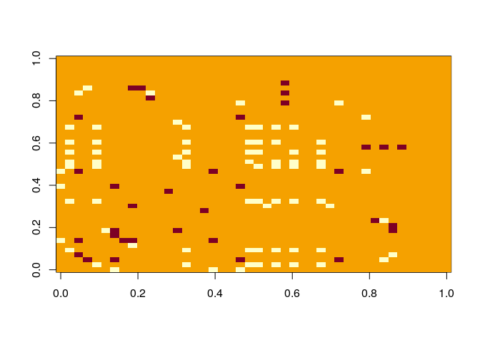

<!-- README.md is generated from README.Rmd. Please edit that file -->
FastCooccur
===========

<!-- badges: start -->
<!-- badges: end -->
The goal of FastCooccur is to perform fast computations of exact cooccurences betwen species pairs. It is designes to be higly scalable thanks to the package future that handle parallelism.

Installation
------------

You can install the released version of FastCooccur from [github](https://github.com/nibortolum/Fastcoocur) with:

``` r
devtools::install_github("Fhttps://github.com/nibortolum/Fastcoocur")
```

Example
-------

This is a basic example which shows you how to solve a common problem:

``` r
library(FastCooccur)
library(vegan)
#> Loading required package: permute
#> Loading required package: lattice
#> This is vegan 2.5-6
## basic example code
data(varespec)

cooc <- fast_cooccur(t(varespec))
#> Sanity check ...
#> Tests passed successfully
#> Preparing for analysis 
#> Generating 946 species pairs
#> Splitting in 2 chunks of roughly 473 pairs
#> 
#> Computing Cooccurences
adjmat <- generate_adjmat(cooc)
#> Rendering adjacency matrix
image(adjmat)
```


